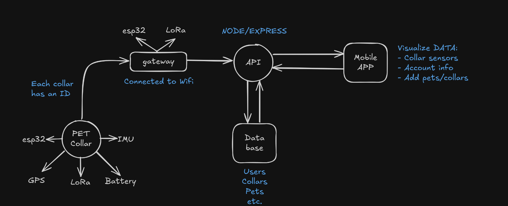

# SNOUT

Snout is a smart collar designed to keep your pet safe and healthy. It uses a built-in GPS to track their location, a temperature sensor to monitor their well-being, and an IMU to follow their activity levels. This information is sent to a mobile app, where you can see a real-time view of your pet's whereabouts and a history of their activity. The collar's key feature is the "safe zone" alert system, which sends an instant notification to your phone if your pet ever wanders outside of a pre-set boundary.

    

## System Architecture

## Components

### Hardware

| **AMOUNT** |       **NAME**       |    **DESCRIPTION**    |
|:----------:|:--------------------:|:---------------------:|
|      2     |         ESP32        |    Main Controller    |
|      2     |     LoRa RYLR998     |     Communication     |
|      1     |        NEO-6M        |          GPS          |
|      1     |       MPU 6050       | Detect Activity Level |
|      1     |        DS18B20       |  Measure Temperature  |
|      1     | 3.7V 3000mAh Battery |      Power Supply     |

### Software

`WiFi.h`: Handles WiFi connectivity.

## Pin Descriptions and Wiring

### Transmitter

| **NEO-6M PIN** | **FUNCTION**  | **ESP32 PIN** |
|----------------|---------------|---------------|
|       VCC      |  Power Supply |      3.3V     |
|       RX       |  UART Receive | TX2 (GPIO 17) |
|       TX       | UART Transmit | RX2 (GPIO 16) |
|       GND      |     Ground    |      GND      |

| **RYLR998 PIN** |  **FUNCTION** | **ESP32 PIN** |
|:---------------:|:-------------:|:-------------:|
|       VDD       |  Power Supply |      3.3V     |
|       GND       |     Ground    |      GND      |
|       TXD       | UART Transmit |    GPIO 26    |
|       RXD       |  UART Receive |    GPIO 25    |

## Receiver

| **RYLR998 PIN** | **FUNCTION**  | **ESP32 PIN** |
|-----------------|---------------|---------------|
|       VDD       |  Power Supply |      3.3V     |
|       GND       |     Ground    |      GND      |
|       TXD       | UART Transmit | RX2 (GPIO 16) |
|       RXD       |  UART Receive | TX2 (GPIO 17) |

## Project Repositories

This project is divided into several repositories to manage the different components of the system.

### Mobile APP

[Snout-APP](https://github.com/hanzeelvilla/snout-app): Mobile application code developed with React Native.

### API (Backend)

[Snout-API](https://github.com/hanzeelvilla/snout-api): Node/Express server code that manages the database and communication with the mobile app.

## Special Thanks

- Esli Castellanos
- Raymundo Buenrostro
