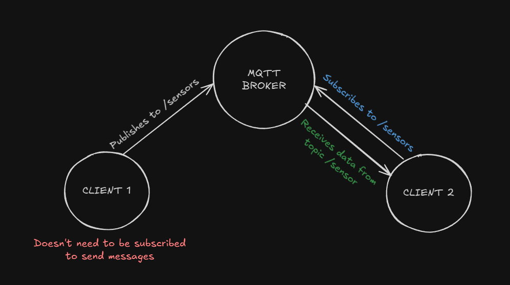

# MQTT

Standard **Messaging protocol** for IoT. MQTT (Message Queuing Telemetry Transport) is a lightweight, publish-subscribe (pub/sub) network protocol designed for Machine-to-Machine (M2M) communication, particularly in environments with resource-constrained devices (like sensors and microcontrollers) and low-bandwidth, high-latency, or unre

MQTT operates using a simple publish/subscribe architecture:

**MQTT Broker (Server)**: The central hub that manages message flow. It receives all messages from publishers, filters them, and sends them to all corresponding subscribers.

**MQTT Client**: Any device or application (from a tiny sensor to a full server) that runs an MQTT library and connects to the broker. A client can be a Publisher or a Subscriber, or both.

**Topic**: A label or hierarchy (like a file path, e.g., home/kitchen/temperature) that the broker uses to categorize messages and route them to interested subscribers.

- **Publisher Clients** send messages to a specific Topic.

- **Subscriber Clients** express interest in a Topic to receive messages published to it.

## Setup & Configuration

To use any of the MQTT examples you need to rename the `config_template.h` file to `config.h` inside each example and
update your credentials

## Documentation

- [MQTT](https://mqtt.org/)
- [Sending Data over MQTT](https://docs.arduino.cc/tutorials/uno-wifi-rev2/uno-wifi-r2-mqtt-device-to-device/)
- [ArduinoMqttClient](https://github.com/arduino-libraries/ArduinoMqttClient)
- [WiFi](https://docs.arduino.cc/libraries/wifi/)
